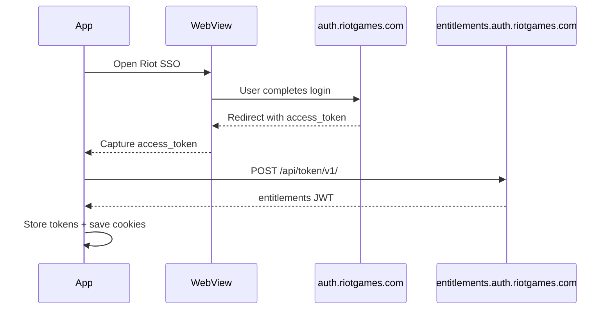

Valstore communicates with two groups of APIs: the official Riot PVP API (requires authentication) and the community-maintained `valorant-api.com` (no authentication required). All calls are made from `RiotService` (`lib/services/riot_service.dart`) and `InofficialValorantAPI` (`lib/services/inofficial_valorant_api.dart`).

## Authentication flow

When a user logs in for the first time, Valstore opens Riot's SSO in a WebView (`lib/login/login_webview.dart`) using `flutter_inappwebview`. After the user completes login, the WebView intercepts the redirect and extracts the `access_token` from the URL fragment.



After capturing the `access_token`, `RiotService.getEntitlements()` sends it to the entitlements endpoint to obtain the entitlements JWT. Both tokens are stored as static fields and sent with every PVP API request.

### Request headers

Every authenticated PVP API call requires these four headers:

```dart
'X-Riot-Entitlements-JWT': entitlements,
'Authorization': 'Bearer $accessToken',
'X-Riot-ClientVersion': '...',   // fetched from valorant-api.com/v1/version
'X-Riot-ClientPlatform': '<base64 encoded platform JSON>',
```

The `X-Riot-ClientVersion` value is fetched fresh from `InofficialValorantAPI.getCurrentVersion()` before making shop or loadout requests. The `X-Riot-ClientPlatform` value is a base64-encoded JSON object describing the platform (Windows PC).

### Re-authentication

When a background WorkManager task runs, the user's session may have expired. `RiotService.reuathenticateUser()` posts to the Riot auth API with the cookies saved by `RiotService.saveCookies()` to obtain a fresh `access_token` silently — without requiring the user to log in again.

```dart
// POST https://auth.riotgames.com/api/v1/authorization
// Body includes saved session cookies
static Future<void> reuathenticateUser() async
```

## Riot PVP API

All endpoints are under `https://pd.{region}.a.pvp.net/` where `{region}` is the value stored in `RiotService.region` (e.g. `eu`, `na`, `ap`).

| Method | Path | Service method | Description |
|---|---|---|---|
| `POST` | `/store/v3/storefront/{userId}` | `getUserOffers()` | Full storefront: daily shop, night market, featured bundle |
| `GET` | `/store/v1/wallet/{userId}/` | `getUserData()` | VP and RP wallet balances |
| `GET` | `/store/v2/offers/` | `getLocalOffers()` | All purchasable item offers with prices |
| `GET` | `/store/v1/entitlements/{userId}/{itemTypeId}` | `getUserOwnedItems()` | Items owned by the player for a given item type |
| `GET` | `/personalization/v2/players/{userId}/playerloadout` | `getPlayerLadout()` | Currently equipped weapon skins and identity items |
| `PUT` | `/name-service/v2/players` | `getUserData()` | Resolve player name and tag from UUID |
| `GET` | `/account-xp/v1/players/{userId}` | `getPlayerLevel()` | Account level and XP |

<Note>
  The `POST /store/v3/storefront/{userId}` endpoint returns the shop, night market, and bundle data in a single response. Valstore parses this into `Storefront`, `SkinsPanelLayout`, and `FeaturedBundle` models.
</Note>

### Item type UUIDs

Pass these UUIDs as `{itemTypeId}` to the entitlements endpoint to query owned items by category:

| Category | UUID |
|---|---|
| Agents | `01bb38e1-da47-4e6a-9b3d-945fe4655707` |
| Contracts | `f85cb6f7-33e5-4dc8-b609-ec7212301948` |
| Sprays | `d5f120f8-ff8c-4aac-92ea-f2b5acbe9475` |
| Gun buddies | `dd3bf334-87f3-40bd-b043-682a57a8dc3a` |
| Player cards | `3f296c07-64c3-494c-923b-fe692a4fa1bd` |
| Weapon skins | `e7c63390-eda7-46e0-bb7a-a6abdacd2433` |
| Skin variants | `3ad1b2b2-acdb-4524-852f-954a76ddae0a` |
| Player titles | `de7caa6b-adf7-4588-bbd1-143831e786c6` |

### Currency UUIDs

| Currency | UUID |
|---|---|
| Valorant Points (VP) | `85ad13f7-3d1b-5128-9eb2-7cd8ee0b5741` |
| Radianite Points (RP) | `e59aa87c-4cbf-517a-5983-6e81511be9b7` |
| Kingdom Credits | `85ca954a-41f2-5a9f-a5e9-dafe6082a1f1` |

## valorant-api.com

These endpoints require no authentication and are called via `InofficialValorantAPI`. They provide skin metadata, cosmetic items, and game version information.

### Metadata endpoints

| Method | Path | Service method | Description |
|---|---|---|---|
| `GET` | `/v1/weapons/skins` | `getAllSkins()` / `getAllPurchasableSkins()` | All weapon skins with levels and chromas |
| `GET` | `/v1/bundles/{uuid}` | `getCurrentBundle()` | Bundle display data for a specific bundle UUID |
| `GET` | `/v1/levelborders` | `getLevelBorders()` | Level border artwork for each account level range |
| `GET` | `/v1/version` | `getCurrentVersion()` | Current game version string (used in `X-Riot-ClientVersion` header) |
| `GET` | `/v1/sprays` | `getSprays()` | All spray cosmetics |
| `GET` | `/v1/playercards` | `getPlayercards()` | All player card cosmetics |
| `GET` | `/v1/playertitles` | `getPlayerTitles()` | All player title cosmetics |
| `GET` | `/v1/buddies` | `getAllDisplayableItems()` | All gun buddy cosmetics |

### CDN image URLs

Skin and cosmetic images are served from `media.valorant-api.com`. Valstore uses `cached_network_image` to download and cache them on first use.

| Asset | URL pattern |
|---|---|
| Player card (small) | `https://media.valorant-api.com/playercards/{id}/smallart.png` |
| Player card (wide) | `https://media.valorant-api.com/playercards/{id}/wideart.png` |
| Player card (large) | `https://media.valorant-api.com/playercards/{id}/largeart.png` |
| Bundle display icon | `https://media.valorant-api.com/bundles/{id}/displayicon.png` |
| Content tier icon | `https://media.valorant-api.com/contenttiers/{id}/displayicon.png` |

<Tip>
  `RiotService.getContentTierByCost(int cost)` maps a VP price to the corresponding `ContentTier` (Select, Deluxe, Premium, Ultra, or Exclusive) without making a network request — the mapping is hardcoded by price range.
</Tip>

## Store link

`RiotService.getStoreLink(String uuid, String region)` returns a direct link to a skin's listing in the Valorant in-game store. This is used in share and deep-link flows.
