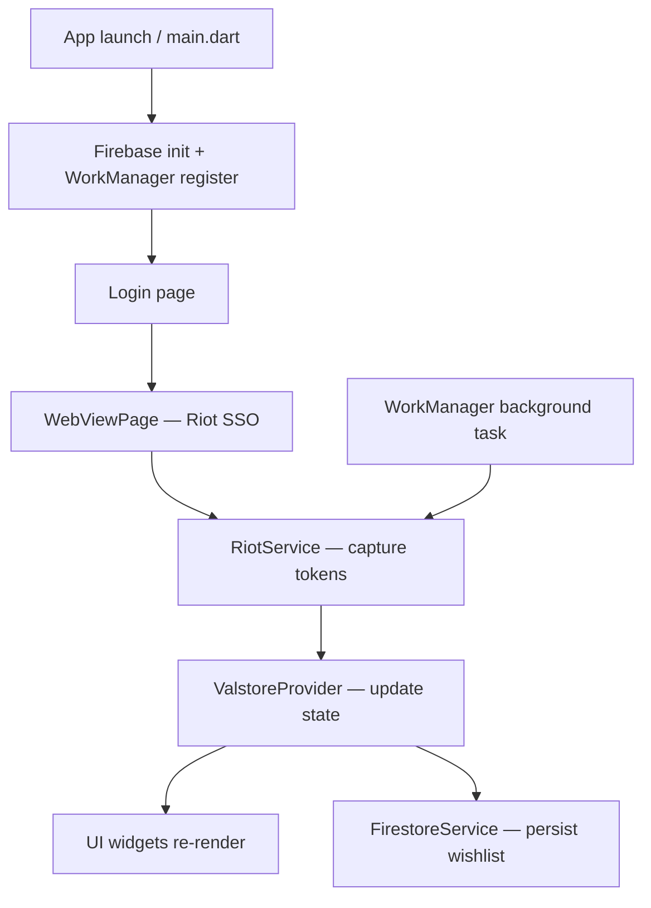

Valstore is a Flutter app that uses the Provider pattern for state management, WorkManager for background tasks, and Firebase for data persistence. The sections below describe how each layer fits together.

## Data flow



On first launch the user selects their region (`RegionPage`), then authenticates through Riot's SSO WebView. The captured tokens are stored in `RiotService` static fields and reused for every subsequent API call. `ValstoreProvider` calls `RiotService` methods to fetch data, stores the result in `_instance`, and calls `notifyListeners()` to rebuild the widget tree.

## Directory structure

| Directory / file | Purpose |
|---|---|
| `lib/account/` | Account page, inventory browser, and equipped loadout view |
| `lib/assets/` | Shared asset widgets (skin images, tier icons, etc.) |
| `lib/galery/` | Favorites (wishlist) page and full purchasable-skin gallery (`galeryv2_page.dart`) |
| `lib/login/` | Home screen, Riot SSO WebView, and first-time region selection |
| `lib/models/` | All data model classes (see [Data models](#data-models)) |
| `lib/routes.dart` | Named route definitions for the entire app |
| `lib/services/` | RiotService, InofficialValorantAPI, FirestoreService, and NotificationService |
| `lib/settings/` | Settings and logout screen |
| `lib/shared/` | Reusable widgets shared across pages |
| `lib/theme.dart` | Global `ThemeData` configuration |
| `lib/valstore_provider.dart` | Top-level `ChangeNotifier` that drives UI state |
| `lib/main.dart` | Entry point — Firebase init, WorkManager setup, `runApp` |

## State management

`ValstoreProvider` extends `ChangeNotifier` and acts as the single source of truth for runtime state. All UI widgets access it via `Provider.of<ValstoreProvider>(context)` or `context.watch`.

```dart
class ValstoreProvider extends ChangeNotifier {
  static late Valstore _instance;

  Future<Valstore> initValstore() async
  Future<List<BundleDisplayData?>?> getBundles() async
  Future<bool> getNightMarket() async
  Future<Player?> getPlayerInfo() async
  void toggleWishlist(String uuid)
  bool isInWishlist(String uuid)
  Future<void> initWishlist() async
  void clearWishlist()
}
```

Each public method follows the same pattern:
1. Call the relevant `RiotService` or `FirestoreService` method.
2. Write the result into `_instance`.
3. Call `notifyListeners()` so dependent widgets rebuild.

`_instance` is the top-level `Valstore` object, which aggregates the player, shop, bundles, night market, and wishlist data into a single serialisable structure.

## Service layer

Valstore uses three service classes, each with a distinct responsibility.

<Columns cols={3}>
  <Card title="RiotService" icon="shield">
    All authenticated calls to `pd.{region}.a.pvp.net`. Holds `accessToken`, `entitlements`, `userId`, and `region` as static fields accessible app-wide.
  </Card>
  <Card title="InofficialValorantAPI" icon="image">
    Unauthenticated calls to `valorant-api.com` for skin metadata, sprays, player cards, gun buddies, level borders, and version info.
  </Card>
  <Card title="FirestoreService" icon="database">
    Reads and writes the user's wishlist to Cloud Firestore. Also queries the Firestore skin registry used to display purchasable skins.
  </Card>
</Columns>

Because `RiotService` methods are all `static`, any part of the app (including the WorkManager `callbackDispatcher`) can call them without holding a reference to an instance.

## Background tasks

`main.dart` registers three periodic tasks with WorkManager at startup:

| Task name | Handler | Purpose |
|---|---|---|
| `ValStoreStoreRenewal` | `RiotService.recheckStore()` | Refresh the daily shop and fire a notification if a wishlisted skin appears |
| `NightMarketRenewal` | `RiotService.recheckNightmarket()` | Poll for night market offers |
| `ValStoreBundleRenewal` | `RiotService.recheckBundle()` | Refresh featured bundle data |

The WorkManager `callbackDispatcher` is a separate Dart entry point registered in `main.dart`. It initialises Firebase independently before running any task, because background isolates do not share state with the foreground app.

<Note>
  WorkManager tasks run even when the app is closed. They re-authenticate silently using saved cookies via `RiotService.reuathenticateUser()` before calling any PVP API endpoint.
</Note>

## Data models

<AccordionGroup>
  <Accordion title="FirebaseSkin">
    Defined in `lib/models/firebase_skin.dart`. Represents a purchasable skin stored in Firestore with `name`, `cost`, `icon`, `levels`, and `chromas`. Used to populate the gallery and resolve wishlist entries.
  </Accordion>
  <Accordion title="Player / PlayerInfo / Wallet">
    Defined in `lib/models/player.dart`. `Player` wraps `PlayerInfo` (name, tag, card) and `Wallet` (VP and RP balances). `PlayerXP` carries the account level.
  </Accordion>
  <Accordion title="Storefront / SkinsPanelLayout / FeaturedBundle">
    Defined in `lib/models/storefront.dart`. `Storefront` is the top-level response from the PVP storefront endpoint. `SkinsPanelLayout` holds the four daily shop offers. `FeaturedBundle` holds the current bundle.
  </Accordion>
  <Accordion title="NightMarket / NightMarketSkin">
    Defined in `lib/models/night_market_model.dart`. `NightMarket` contains a list of `NightMarketSkin` objects, each with original cost, discounted cost, and discount percentage.
  </Accordion>
  <Accordion title="PlayerShop / BonusStore / ContentTier">
    Defined in `lib/models/store_models.dart`. `PlayerShop` aggregates the daily offers and bonus store. `ContentTier` maps a VP cost to a rarity tier (Select, Deluxe, Premium, Ultra, Exclusive).
  </Accordion>
  <Accordion title="Loadout / Guns / Identity">
    Defined in `lib/models/loadout.dart`. Represents the player's equipped weapon skins (`Guns`) and cosmetic identity items (`Identity`) returned by the loadout endpoint.
  </Accordion>
</AccordionGroup>

## Firebase setup

Valstore uses `firebase_core`, `cloud_firestore`, and `firebase_auth`. Firebase is initialised in both `main.dart` and the WorkManager `callbackDispatcher`.

<Warning>
  The app will not build without a valid `google-services.json` placed in `android/app/`. Without it, the Gradle build fails and Firestore / Auth are unavailable at runtime. See [Building Valstore](/development/building) for setup steps.
</Warning>

Firestore is used for two things:

- **Skin registry** — a collection of `FirebaseSkin` documents queried when building the gallery.
- **User wishlist** — per-user documents managed by `FirestoreService` (`lib/services/firestore_service.dart`).
